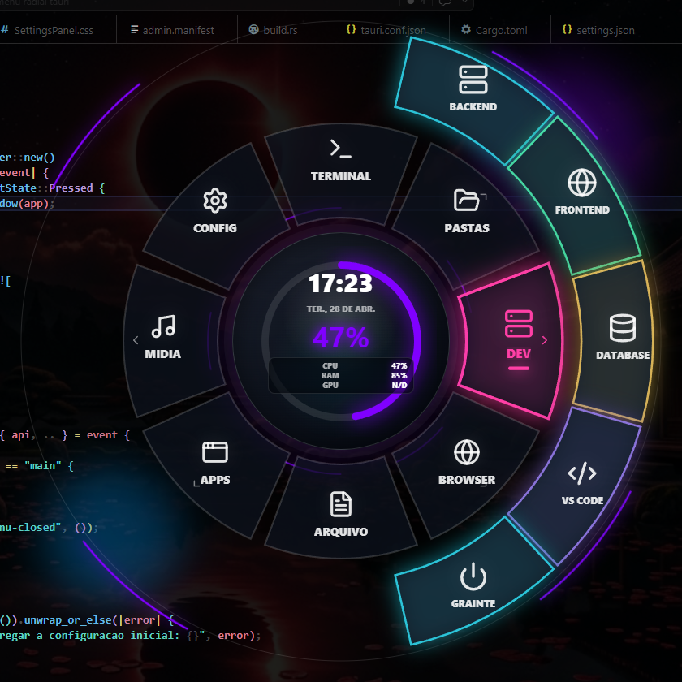

<div align="center">

# 🌌 Frosted Radial Menu



**Launcher radial desktop para Windows, com design futurista e alta performance.**

[](#)
[](#)
[](#)
[](#)
[](#)

*Leve, animado, customizável e compilável para `.exe` sem depender de APIs externas.*

</div>

<hr/>

## ✨ Recursos Principais

- 🔘 **Menu Radial Transparente**: Efeito *glass/neon* elegante.
- 📂 **Submenus Inteligentes**: Abrem na direção exata da fatia clicada.
- 📊 **Monitoramento em Tempo Real**: Centro exibe hora, CPU, RAM e GPU.
- ⚙️ **Altamente Configurável**: Edite botões, ícones, cores, tipos de ação, comandos e atalhos pelo painel visual.
- 🎨 **Personalização Visual Completa**: Ajuste escala, raio, largura, espaço, tamanhos, fontes, brilho (glow) e muito mais.
- 💾 **Configuração Persistente**: Salva localmente em JSON no diretório do usuário, mantendo as configurações seguras.
- 🦀 **Backend Poderoso em Rust**:
  - Abre arquivos, pastas, atalhos, `.exe` e URLs.
  - Executa comandos PowerShell ou CMD.
  - Manipula e controla janelas (abrir/esconder).
  - Coleta estatísticas de hardware em tempo real (CPU/RAM).
- 🖱️ **System Tray**: Ícone prático na bandeja do sistema para acessar configurações ou sair.
- ⌨️ **Hotkey Global**: Abre e fecha o menu rapidamente (`Alt+Space` configurado por padrão).
- 🚀 **Auto-Start Opcional**: Inicialização junto com o Windows via Tarefa Agendada.

---

## 🛠️ Stack Tecnológico

- **Frontend**: React, TypeScript, Vite, `lucide-react`.
- **Backend / Desktop**: Tauri 2, Rust.
- **Sistema Alvo**: Windows.

---

## 📂 Estrutura do Projeto

- `src/`: Interface React.
  - `src/components/RadialMenu.tsx`: Menu principal.
  - `src/components/SettingsPanel.tsx`: Painel de configuração.
  - `src/lib/menuConfig.ts`: Tipos e configuração padrão.
- `src-tauri/src/lib.rs`: Comandos Rust (tray, hotkey, config, hardware stats).
- `src-tauri/tauri.conf.json`: Configuração central do app Tauri.
- `docs/PLAN.md`: Plano de produto, distribuição e portabilidade.

---

## 💻 Desenvolvimento

Em ambiente de desenvolvimento, o comando abaixo sobe o Vite e o backend Tauri em conjunto:

```bash
npm install
npm run tauri dev
```

> **Nota:** O Vite utiliza a porta `http://127.0.0.1:5180`. Se a porta estiver ocupada, encerre o processo no PowerShell antes de tentar novamente:
> ```powershell
> Get-NetTCPConnection -LocalPort 5180 -State Listen
> Stop-Process -Id <PID> -Force
> ```

💡 **Dica:** Se o atalho global não estiver abrindo o menu, pode haver outra instância antiga rodando em segundo plano. Feche-a pelo ícone da bandeja ou encerre o processo antes de rodar o comando novamente.

---

## ✅ Validação

Comandos úteis para manter a qualidade do código:

```bash
npm run lint
npm run build
cd src-tauri
cargo check
```

---

## 📦 Build para Windows

```bash
npm run tauri build
```

Os artefatos gerados ficarão nos seguintes diretórios:
- **Instalador NSIS:** `src-tauri/target/release/bundle/nsis/` (arquivo `-setup.exe`)
- **Binário Direto:** `src-tauri/target/release/Frosted Radial Menu.exe`

### ℹ️ Detalhes da Instalação
O app **não** precisa de Node.js ou Rust no computador do usuário final. Essas ferramentas são usadas apenas para desenvolvimento e compilação.
- O runtime utilizado é o **Microsoft Edge WebView2**. O instalador utiliza a diretiva `downloadBootstrapper` para baixar e instalar o WebView2 caso ele não exista na máquina.
- A instalação utiliza `installMode: currentUser`, instalando apenas para o usuário atual e evitando pedidos de permissão de administrador (UAC).
- O NSIS copia o app para `%LOCALAPPDATA%\Frosted Radial Menu` e cria atalhos no **Menu Iniciar** e na **Área de Trabalho**.

> ⚠️ Os executáveis (`.exe`) não devem ser commitados no repositório. O ideal é publicá-los nas **Releases do GitHub**.

---

## 🌍 Portabilidade

Este projeto foi desenhado para **não** depender de caminhos específicos do computador do desenvolvedor. Utilize variáveis de ambiente do Windows nas configurações para garantir que funcione em qualquer máquina:

- `%USERPROFILE%\Desktop`
- `%USERPROFILE%\Downloads`
- `%APPDATA%`
- `%LOCALAPPDATA%`

As configurações reais do usuário ficam fora do repositório. Arquivos locais, presets pessoais, builds, screenshots de QA e caches estão ignorados no `.gitignore`.

---

## 🗺️ Roadmap

- [ ] Criar/remover atalho na Área de Trabalho pelo painel de configurações.
- [ ] Importar e exportar presets de personalização.
- [ ] Reordenar fatias e submenus diretamente no painel.
- [ ] Detectar aplicativos comuns do PC do usuário para montar um preset inicial automatizado.

---

## 📄 Licença

**MIT**. Veja o arquivo `LICENSE` para mais detalhes.

<br/>

<div align="center">
  
</div>
