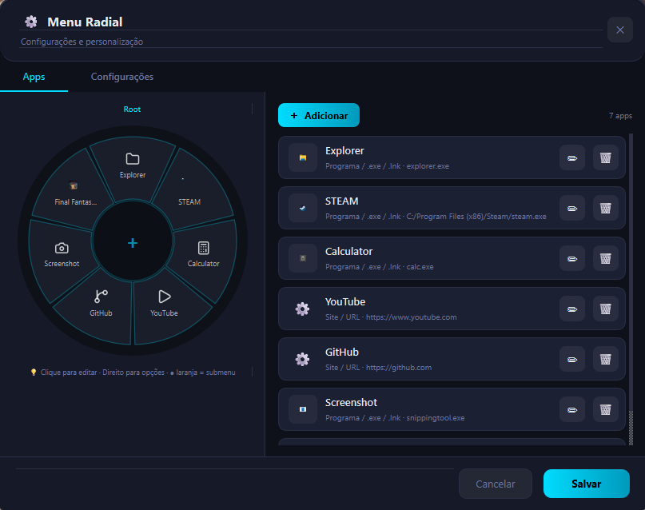
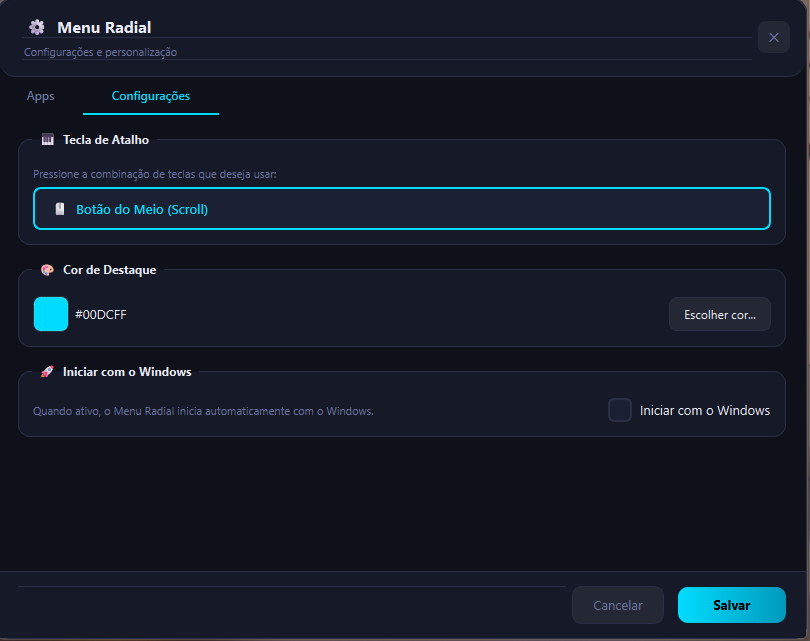
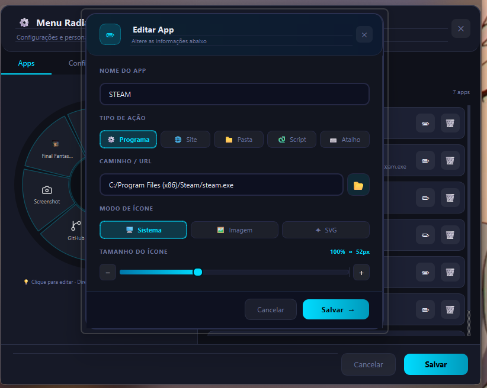

# Menu Radial — Frosted Glass

A customizable radial productivity menu for Windows with glassmorphism UI, recursive submenus, per-item icon control, and a robust global hotkey system.

Um menu radial para Windows feito com **PySide6**, com visual *glassmorphism*, atalho global configurável e interface gráfica de configuração.

O objetivo deste repositorio e ser facil de usar mesmo sem compilar: baixar, dar dois cliques no instalador e usar.

## Preview


### Novos recursos visuais

| Editar Atalhos | Configuracoes |
|:-:|:-:|
|  |  |



## O que ele faz

- Abre um menu radial perto do cursor com `Alt + Espaco`
- Executa programas, atalhos de teclado, pastas, scripts e URLs
- Fica rodando na bandeja do sistema
- Tem suporte a submenu e visual animado
- **Interface grafica de configuracao** — sem precisar editar JSON manualmente
- **Sistema de icones flexivel**: extrai icone nativo do .exe, usa imagem customizada ou icone SVG
- **Escala de icone por item** — controle individual de tamanho para cada atalho
- **Atalhos de mouse e teclado**: suporte a `mouse_middle`, `mouse_side1`, `mouse_side2` alem de combinacoes de teclado
- **Fecha ao clicar fora** via hook global — funciona mesmo clicando no desktop ou em outro app

## Instalacao Facil no Windows

1. Baixe este repositorio como ZIP e extraia a pasta.
2. Instale o Python para Windows, caso ainda nao tenha.
3. De dois cliques em `install_and_setup.bat`.
4. Aguarde a instalacao terminar.
5. Use o atalho `Menu Radial` criado na Area de Trabalho.

O instalador faz tudo isso automaticamente:

- cria um ambiente local em `.venv`
- instala as dependencias
- cria um atalho na Area de Trabalho
- pode configurar inicio automatico com o Windows

## Como usar

1. Abra o Menu Radial pelo atalho da Area de Trabalho ou por `run_menu.bat`.
2. O icone aparece na bandeja do sistema.
3. Pressione `Alt + Espaco` para abrir o menu.
4. Clique nas fatias para executar a acao desejada.
5. Pressione `Esc` ou clique fora para fechar.

## Configuracao

O arquivo publico padrao e `config/config.json`.

Se voce quiser manter uma configuracao pessoal sem subir no GitHub, crie `config/config.local.json`.
Quando esse arquivo existir, ele tem prioridade sobre o `config/config.json`.

### Exemplo rapido

```json
{
  "menu": {
    "items": [
      {
        "label": "Apps",
        "icon": "layout-grid",
        "children": [
          { "label": "Terminal", "icon": "terminal", "action": "run", "target": "wt.exe" }
        ]
      }
    ]
  },
  "settings": {
    "hotkey": "<alt>+<space>",
    "accent_color": "#00DCFF"
  }
}
```

## Arquivos importantes

- `install_and_setup.bat`: instalador de um clique
- `run_menu.bat`: inicializador visivel
- `run_hidden.vbs`: inicializador silencioso
- `setup_startup.bat`: ativa inicio automatico no Windows
- `config/config.json`: menu publico padrao
- `src/core/`: logica principal da interface e das acoes

## Observacoes

- Este projeto e focado em Windows.
- O repositorio nao precisa ser compilado para funcionar.
- Dependencias atuais: `PySide6`, `pynput` e `psutil`.

---

## Novidades

### Interface Grafica de Configuracao

Acesse em: bandeja do sistema → botao direito → **Configuracoes**.

- Preview visual do menu em tempo real
- Adicione, remova e reordene atalhos
- Editor completo por item sem editar JSON

### Sistema de Icones por Item

Cada atalho pode usar um dos tres modos:

| Modo | Descricao |
|---|---|
| **Auto** | Extrai o icone nativo do executavel automaticamente |
| **Imagem** | Usa imagem customizada (PNG, ICO, JPG...) |
| **SVG** | Usa icones vetoriais da biblioteca Lucide embutida |

### Escala de Icone Individual

Slider de **50% a 200%** por item. O label do atalho acompanha o tamanho do icone automaticamente.

### Atalhos Globais Ampliados

Suporte a qualquer combinacao de teclas e **botoes do mouse**:

```
Alt+Espaco   Ctrl+F1   Win+R   mouse_middle   mouse_side1   mouse_side2
```

Configure em Configuracoes → campo Atalho.

### Fechar ao Clicar Fora

O menu fecha automaticamente ao clicar em qualquer area fora dele,
incluindo desktop e outras janelas, via hook global Win32.
